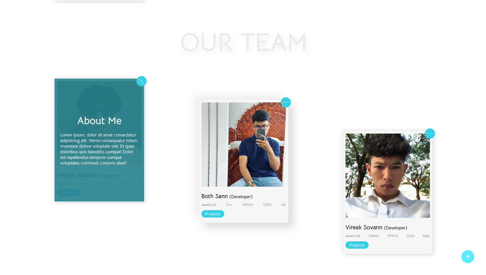

# The Creative Website 🎨

## Overview

The Creative Website is a visually engaging and responsive design portfolio showcasing creative design, customer testimonials, team members, and contact information. It includes smooth animations, user-friendly navigation, and interactive features such as testimonials and team member profiles.

----

## 🖼️ Screenshots

### Screenshot 1


### Screenshot 2


### Screenshot 3


### Screenshot 4


---

## Features ✨

- **Responsive Design**: The website adapts to different screen sizes for a seamless experience on desktops, tablets, and smartphones.
- **Customer Testimonials**: Displays customer reviews with star ratings and images.
- **Team Profiles**: Features a list of team members with their skills, personal stories, and a link to their projects.
- **Contact Form**: A contact section that allows users to send messages directly from the website.
- **Smooth Scroll**: Navigation includes a smooth scroll feature for quick access to different sections of the site.
- **Floating Animation**: A dynamic background animation that adds visual interest to the header.

---

## Sections 📑

1. **Header**: Contains the main navigation links and the website's primary heading with a logo.
2. **Customers Section**: Displays testimonials from customers with star ratings and a short description of their experience.
3. **Team Section**: Shows profiles of the design and development team members, their skills, and a brief biography.
4. **Contact Section**: A simple form for users to contact the website owner.
5. **Scroll-Up Button**: A floating button allowing users to quickly navigate back to the top of the page.

---

## Technologies Used 💻

- **HTML5**: Structure of the website.
- **CSS3**: Styling of the website with animations and responsiveness.
- **Font Awesome**: Icons for the design elements and team member profiles.
- **JavaScript**: For interactive elements like the scroll-up button.

## Setup Instructions 🛠️

1. Clone this repository to your local machine.
   ```bash
   git clone https://github.com/BothSann/thecreative-website.git

---

## 👨‍🍳 Author

© Copyright by **THANN SOPHEAKBOTH** - *Creator of the project*


